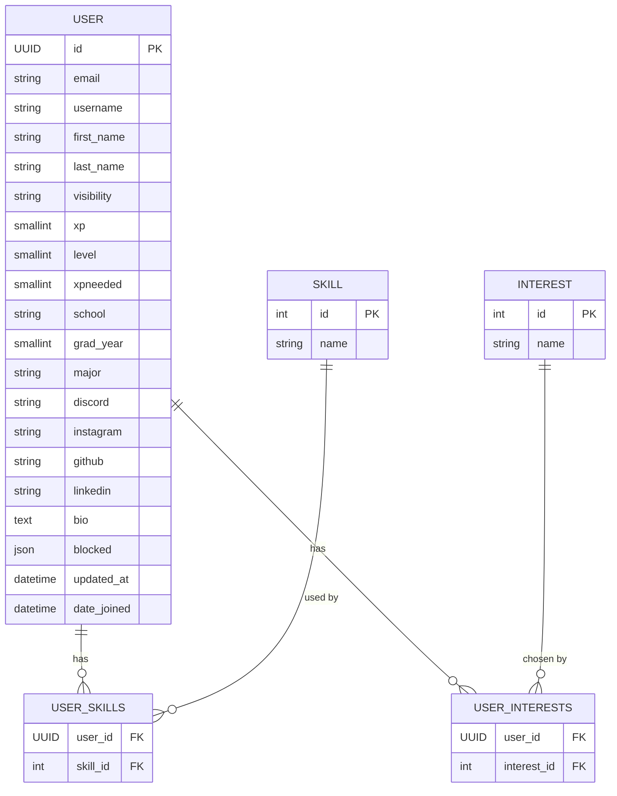

# Django + PostgreSQL backend

## Prerequisites

- **Docker Engine**
- **Docker Compose v2** plugin

## Setup
first setup .env file

use example_env

or look at the shared drive for mine

*might need to use sudo*

docker compose build

docker compose up

*check http://localhost:8000/ to confirm it worked*

## Useful Commands

- **docker compose down** (stop everything)
- **docker compose up** (start)

- **docker exec -it postgres psql -U postgres** (access area to run postgres commands)
- **\c <database_name>** *just do \c for default db* (enter a database)
- **\d** (view stuff in the db you entered)
- **\d+ <table_name>**
- **\q** (quit)

- **docker exec -it django bash** (enter container for the backend)
- run commands for django here and other related stuff

## Tips
- NEVER run pip install ....   instead add it to requirements.txt
- Don't run django commands outside of the docker container (explanation on how to enter in commands section)

## Models

### Accounts

